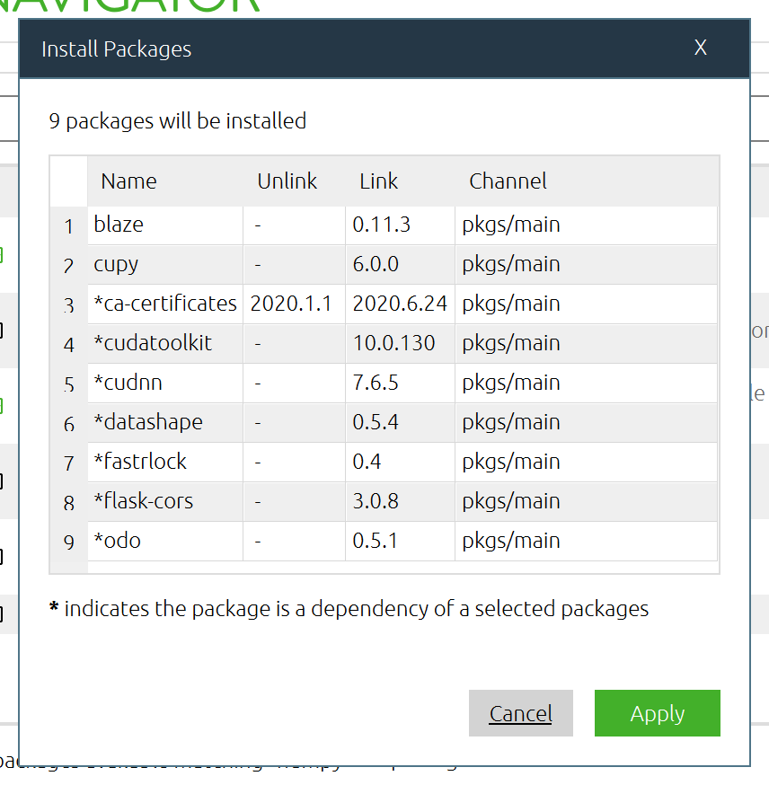

# Anaconda installation and usage

- To install Anaconda go to: [https://www.anaconda.com/products/individual](https://www.anaconda.com/products/individual) and click download. This will take you to a number of links for Windows installers, Linux installers and MacOS installers.
- We will be installing **Python 3.9** (or the latest Python distribution), this is not dependent on the operating system. If you are using Windows or MacOS you will most likely need to choose the 64-bit Graphical Installer. If using Linux you will choose the 64-bit (x86) Installer.
- Once the installer has downloaded, you will launch it and it should be a matter of clicking through and installing.

# The Anaconda navigator

## Opening the navigator

#### Windows

The easiest way to open the Anaconda Navigator in Windows is to type _Anaconda_ into the start menu, which should give the result __Anaconda Navigator__, which you should open:

#### MacOS

Once Anaconda has installed, the Anaconda navigator should appear in your launchpad:

#### Linux

To open the Anaconda Navigator in Linux, open the terminal, type `anaconda-navigator` and press enter.

## Using the navigator

The Anaconda Navigator is essentially identical for Windows, Linux and MacOS:

### Searching and installing packages

_Note: you do not need to do this. The packages `blaze` and `cupy` are given as random examples. These instructions are here in case you'd like to install new packages later on._

To browse packages both already installed and not yet installed click on __Environments__ on the left side of the navigator:

If necessary you can click the __<__ to bring the package browser to full view. You will see near the top a drop-down menu with __Installed__ selected. All the packages being displayed then are packages that are already installed. You might notice under the _Version_ column some packages have _custom_. This is simply because Anaconda is a best effort at gathering a range of up-to-date packages, but conflictions and dependencies only make this possible up to a point, and it is nothing to be worried about.

To find packages that are not installed select __Not installed__ in the drop down menu:

To find a specific library, or libraries related to existing libraries, you can use the search bar. For example, searching __numpy__ will yield a number of results relating to the Numpy library:

To install one or a number of these packages, __blaze__ and __cupy__ for example, simply select them, click __Apply__ which should appear at the bottom-right. _Solving package specifications_ may take a short while before seeing the window:

A number of dependencies, marked with an asterisk, may also appear. Click __Apply__ to finish the installation process.

### Starting a Jupyter notebook

Starting a Jupyter notebook in a browser is as easy as locating __Jupyter Notebook__ in the __Home__ tab and clicking __Launch__ :

Jupyter should open in your default browser (Firefox, Chrome, Safari et cetera).

## Running Python with Jupyter

When Jupyter has opened in your browser you should see the following:

Here will contain a bunch of folders and files specific to your device, and it works largely like any file directory. Specifically, you should see your home directory, and you can check this by navigating the folders.

To open a Jupyter notebook that you have already saved in a folder, navigate to that folder and select the file.

To start a new Python notebook first make sure you are in a directory (folder) in which you would like your Jupyter files to be saved (by default your Jupyter files will save in this folder), then click __New__ and select __Python 3__.
