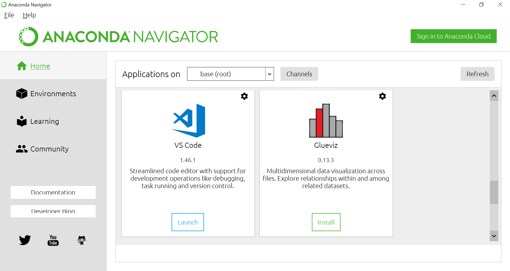

# Visual Studio Code Installation

**Visual Studio Code** (**VSCode**) is a code editor that can be used to edit and debug code. It was once included with the Anaconda, but that is no longer the case. You can still download and install it easily, and it will even appear as an application in your Anaconda navigator once it's installed.

To install, go to [https://code.visualstudio.com/](https://code.visualstudio.com/) where you will see a button asking you to download for your operating system (Windows, Linux or MacOS). If you are using Linux, it will give you options for different Linux distributions. If it does not say your operating system then click the down-arrow and change it accordingly. You should execute the file that is downloaded, and just like with Anaconda it should be a simple matter of clicking through to get it installed.

Once this is finished it **may** appear in your Anaconda navigator (note that this will not necessarily be the case):

If you are using MacOS, you may need to move the VSCode application into your applications directory (so that it appears in your _Launchpad_), before it will appear in your Anaconda navigator.

You can now start VSCode from your Anaconda navigator by clicking **Launch**. It may take a moment before you see the VSCode welcome tab:

The icons on the top left are different "tabs". The first one is the Explorer tab. You can click "Clone repository" to clone a repo from GitHub.

# Install the Python extension

The 5th icon down is the Extensions tab. Click on it and search "python" to install the Python extension (by Microsoft):

